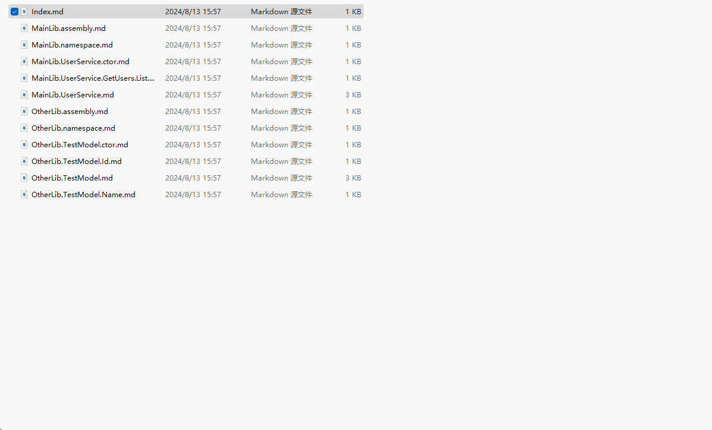

# sharp-lib-markdown-doc-generator

.net类库api文档(markdown)生成器

## 截图
</img>

### ⚠️ 注意事项

* 不支持.netframework 类库 
* 不应该在输出目录中做文件改动 
* 提前构建项目生成 dll 和 xml 文件(需要在项目文件中添加配置`<GenerateDocumentationFile>True</GenerateDocumentationFile>`)

## 使用

1. 新建控制台应用程序(.Net6.0+)，并引用`SharpLibMarkdownDocGenerator`nuget 包

2. 添加如下代码

```csharp
using SharpLibMarkdownDocGenerator;

public static void Main(string[] args)
{
    var dllPath = @"your/path/your.dll";
    var outputDirectory = @"/output";
    var request = new GenerateRequest(dllPath, outputDirectory);
    Generator.Generate(request);
}
```

## GenerateRequest 参数说明

#### 1. DllPath

dll 文件路径,在该目录中同时应该包含 deps.json 和 xml 文件

#### 2. OutputPath

文档输出的位置,不应该在生成的目录中做文件修改,因为可能生成多次,有被覆盖的可能

#### 3. AddtionalMarkdownDirecotry

额外需要补充的文档目录
使用方式

- 先运行一次文档生成,假设结果产生了`a.md,b.md,c.md`
- 现在我们想对`a.md`进行一个示例的补充
- 在 AddtionalMarkdownDirecotry 中新建文件`a.md`，并添加内容
- 再次运行文档生成,这时产生的`a.md`中会将 AddtionalMarkdownDirecotry 文件夹中`a.md`内容嵌入到最后

#### 4.ExternalUrlResolver

外部地址处理器
如`public ThirdPartyType GetData()`这样的函数中`ThirdPartyType`是第三方库中的类型

```csharp
var request = new GenerateRequest(dllPath, outputDirectory);
request.ExternalUrlResolver = (type)=>
{
    if (type.Name.Equals("ThirdPartyType")) return "https://www.thirdparty.com/doc/ThirdPartyType.md";
    return GenerateRequest.ResolveMicrosoftDoc(type);//微软官方文档
};
```
